# CMPE 172 - Lab #10 Notes

## Screenshots (in Markdown README.md) for CI Workflow (Part 1)

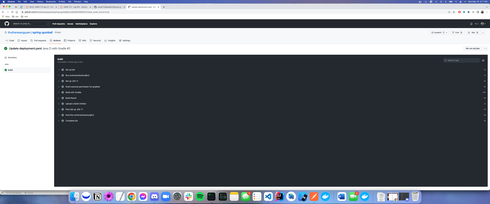

## Screenshots (in Markdown README.md) for CD Workflow (Part 2)

### GCP Service Accoucnt & JSON Service Account Key

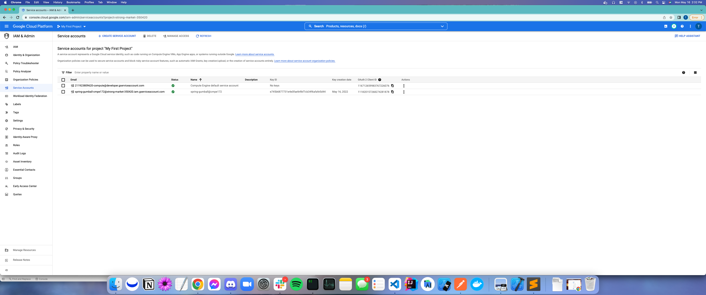
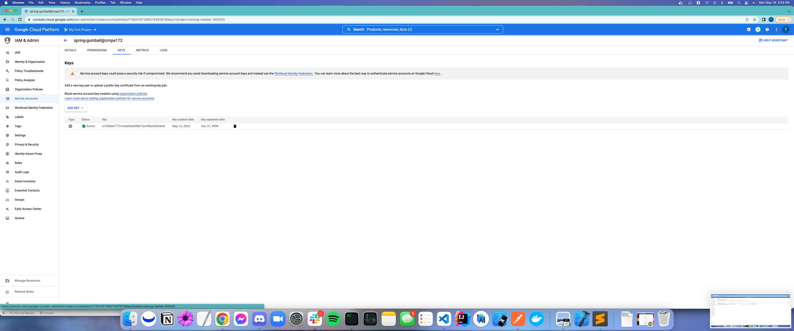

### GitHub Action Secrets

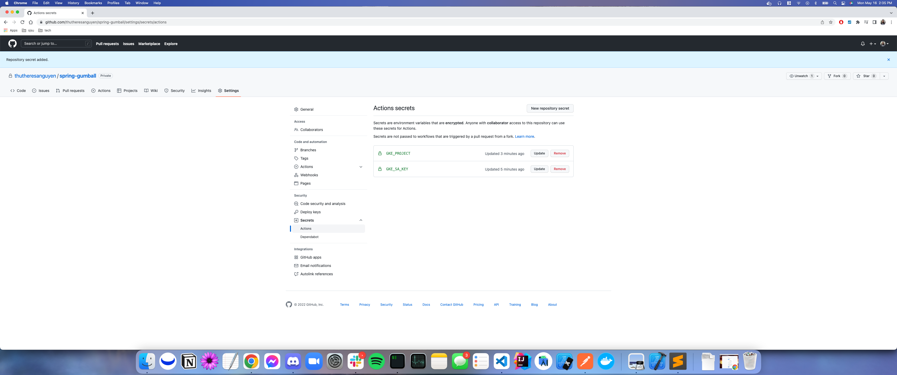

### Trigger a CD Deployment by creating a new GitHub Release

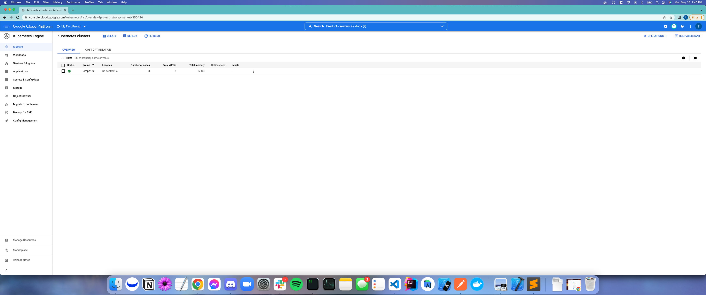

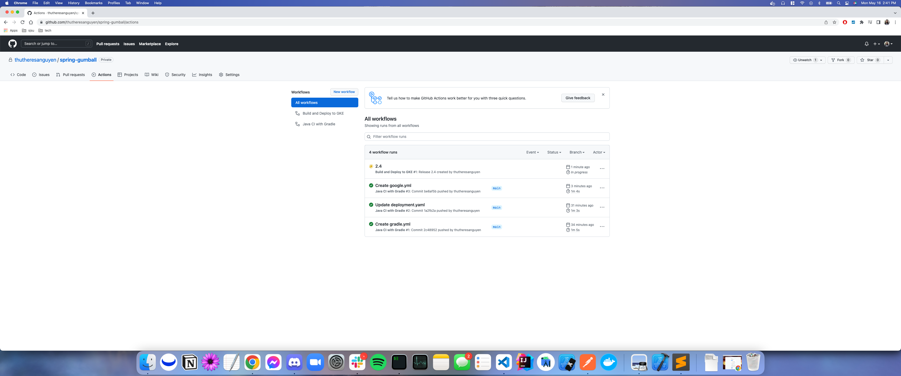
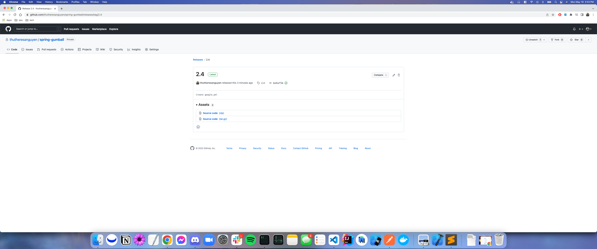
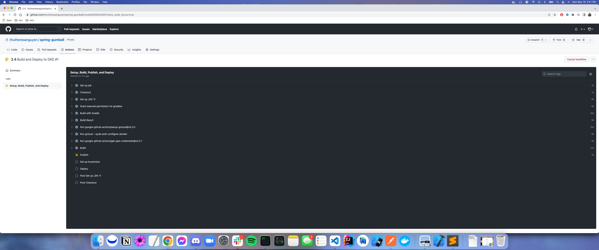

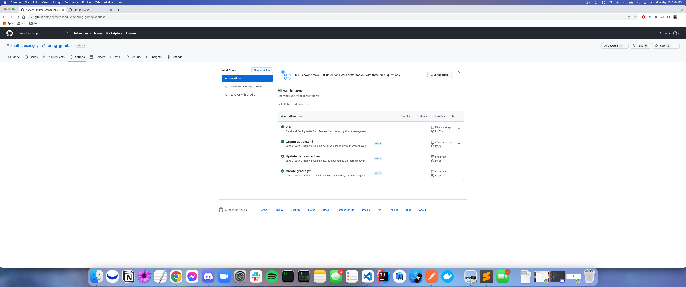

### Confirm the Pods and Service have been Deployed to your GKE Cluster

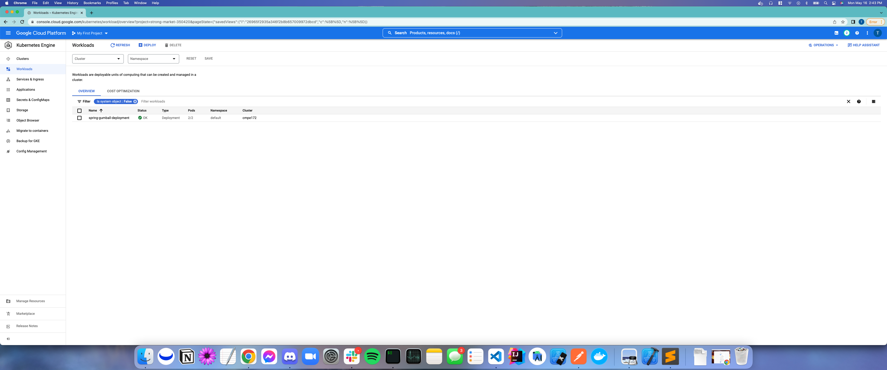
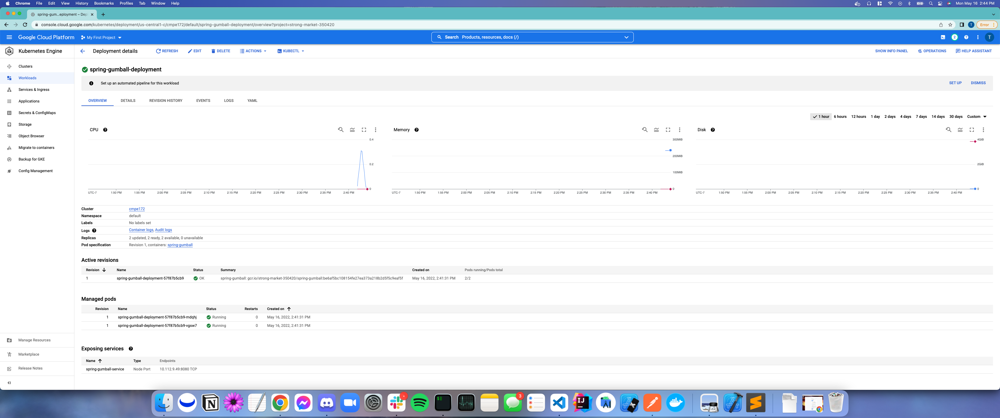

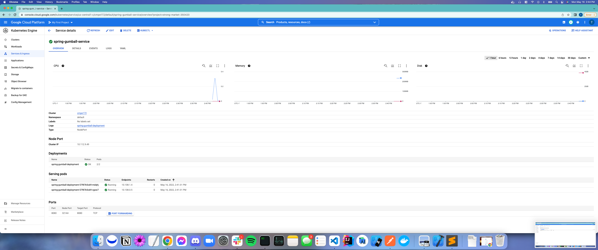

### Set up a External Facing Load Balancer and Test the Gumball Spring App. Web UI should come up on Load Balancer's External IP

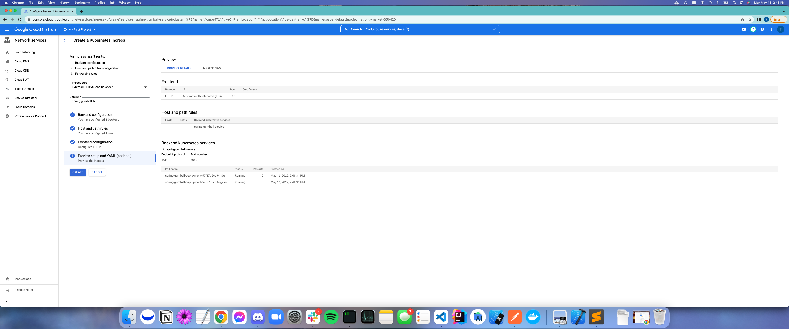
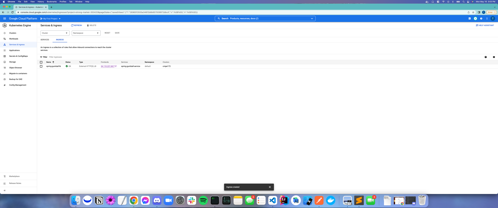
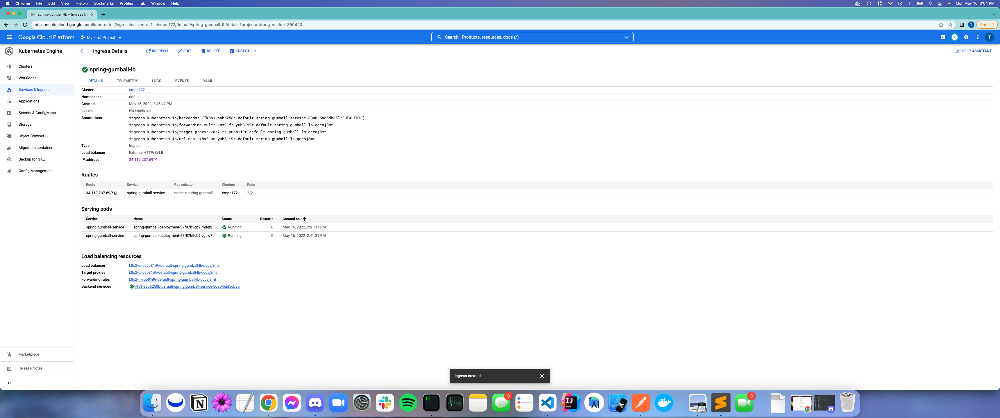
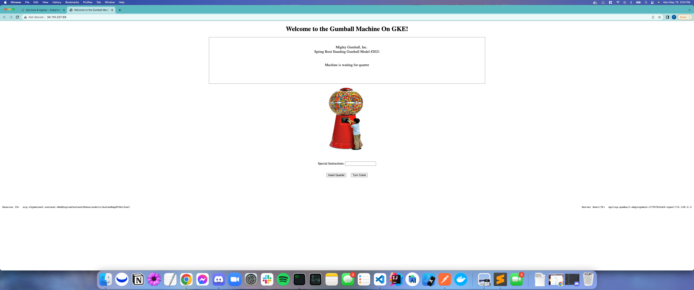
